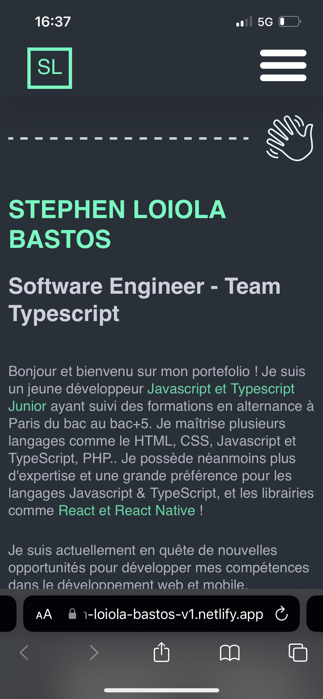

<h1 align="center"> Portfolio v1 </h1>

<strong>Owner</strong> : Stephen Loiola Bastos  
<strong>Link</strong> : https://stephen-loiola-bastos-v1.netlify.app/  
<strong>PC Screen </strong> :  

<strong>Mobile screenshot</strong> :  

<h2>Build with</h2>

- React.js
- Redux
- Styled components
- CSS3

<h2>Features</h2>

**🎨 Styled with styled-components**

**📱 Fully Responsive**

<h2>Advices</h2>

Hey ! You can give me somes advices for the code quality OR/AND you
can give me suggestions !

### `npm start`

Runs the app in the development mode.\
Open [http://localhost:3000](http://localhost:3000) to view it in the browser.

The page will reload if you make edits.\
You will also see any lint errors in the console.
